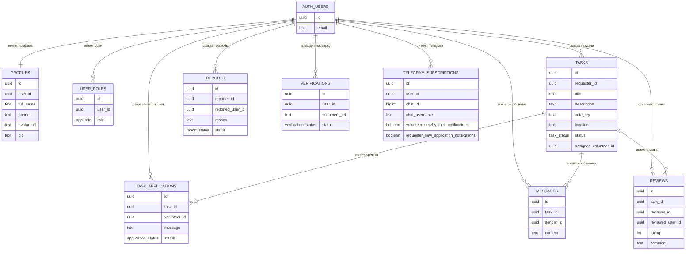

# Биржа услуг

Интернет-платформа **«Биржа услуг»** помогает людям просить о помощи и помогать другим.

Один пользователь создаёт задачу. Другой пользователь видит задачу, откликается и может стать исполнителем.

## Роли пользователей

- **Заказчик** создаёт задачи.
- **Волонтёр** ищет задачи и отправляет отклики.
- **Модератор** проверяет жалобы и верификацию.

## Основные функции

- регистрация и вход;
- профиль пользователя;
- роли пользователей;
- создание задач;
- поиск и фильтрация задач;
- отклики волонтёров;
- назначение исполнителя;
- сообщения по задаче;
- отзывы;
- жалобы;
- верификация пользователя;
- Telegram-уведомления.

## Технологии

### Клиентская часть

- React
- TypeScript
- Vite
- React Router
- Tailwind CSS
- shadcn-ui
- React Leaflet

### Серверная часть

- Supabase
- PostgreSQL
- Supabase Auth
- Row Level Security
- Supabase Edge Functions
- Supabase API

## Как работает backend

Backend построен на Supabase.

Клиентская часть отправляет запрос в Supabase API. Supabase Auth проверяет пользователя. После этого PostgreSQL проверяет права доступа через RLS-политики.

Если доступ разрешён, база данных выполняет запрос и возвращает ответ в формате JSON.

Пример:

```ts
const { data, error } = await supabase
  .from("tasks")
  .select("*");
```

Так приложение получает задачи из таблицы `tasks`.

## API

В проекте используется REST API Supabase.

Разработчик не пишет все endpoints вручную. Supabase автоматически даёт API для таблиц PostgreSQL через PostgREST.

Примеры действий:

- `select` получает данные;
- `insert` создаёт запись;
- `update` меняет запись;
- `delete` удаляет запись.

## Безопасность

В проекте используются:

- **JWT-токен** — показывает, кто пользователь;
- **RLS** — проверяет, какие данные можно видеть или менять;
- **роли** — дают разные права заказчику, волонтёру и модератору.

Простой пример:

Заказчик может редактировать свою задачу. Но он не может редактировать чужую задачу.

## Схема базы данных

Ниже показана простая схема БД.



## Простое описание таблиц

### `auth.users`

Это таблица Supabase Auth. В ней хранятся пользователи для входа в систему.

### `profiles`

Хранит профиль пользователя: имя, телефон, фото и описание.

### `user_roles`

Хранит роли пользователя: `requester`, `volunteer`, `moderator`.

### `tasks`

Главная таблица проекта. В ней хранятся задачи.

### `task_applications`

Хранит отклики волонтёров на задачи.

Один волонтёр может отправить только один отклик на одну задачу.

### `messages`

Хранит сообщения между участниками задачи.

### `reviews`

Хранит отзывы и оценки после выполнения задачи.

### `reports`

Хранит жалобы пользователей.

### `verifications`

Хранит заявки на проверку пользователя.

### `telegram_subscriptions`

Хранит настройки Telegram-уведомлений.

## Целостность данных

В базе используются:

- **внешние ключи** — связывают таблицы;
- **unique-ограничения** — не дают создавать дубликаты;
- **enum-статусы** — разрешают только правильные статусы.

Пример:

Отклик связан с задачей через `task_id`. Если задачи нет, отклик создать нельзя.

## Запуск проекта

Установить зависимости:

```sh
npm install
```

Запустить проект:

```sh
npm run dev
```

Открыть в браузере:

```text
http://localhost:8080
```

## Сборка проекта

```sh
npm run build
```

## Тесты

```sh
npm run test
```

## Структура проекта

```text
src/
  components/        компоненты интерфейса
  hooks/             React hooks
  integrations/      подключение Supabase
  pages/             страницы приложения
  lib/               вспомогательная логика

supabase/
  migrations/        SQL-структура базы данных
  functions/         Edge Functions
```

## Автор

Хабиб Петер Нобар Зареф

Бальбола Айад Шади Мустафа Мустафа
